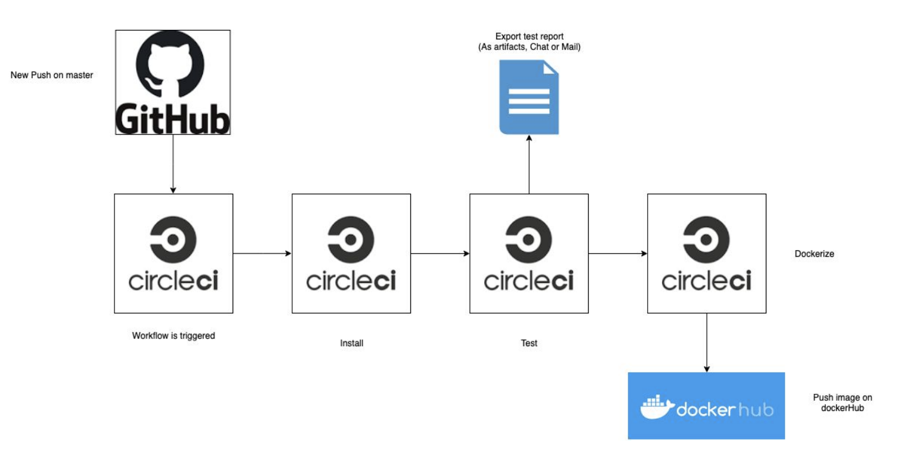

# B3 Devops Projet - Team 7

## Informations

### Team 7 - Composition

* Mail: yanisse.youmi@ynov.com  <br>
Github_username: DeadSkill <br>

* Mail: hugo.lantillon@ynov.com<br>
Github_username: HugoTys21<br>

## TP

### Objectifs à atteindre

* Orchestrer le build et le déploiement d’un projet NodeJS simple
* Découvrir les méthodes et outils d’automatisation
* Implémenter des tests simple
* Packager une application

### Ressources et bibliographie

- [Documentation Docker](https://docs.docker.com/)
- [Documentation CircleCI](https://circleci.com/docs/2.0/env-vars/)
- [Documentation CircleCI - bis](https://circleci.com/docs/enterprise/quick-start/)
- [Documentation Yaml](https://yaml.org/)

### Prérequis

- Docker
> Pour l'installer : [Docker](https://docs.docker.com/install/)
- Docker Compose
- Nodejs
> Pour l'installer : [NodeJS](https://nodejs.org/en/download/)
- Bash/Terminal/PowerShell

## Installation - Explication

### Qu'est ce que CircleCI?

CircleCI permet aux équipes d'ingénierie d'automatiser leurs tâches à l'aide de l'intégration continue que propose CircleCI.

## Qu'est ce que l'intégration continue?

- L'intégration continue
L'intégration continue est une pratique qui encourage les développeurs à intégrer leur code dans une masterbranche d'un référentiel partagé tôt et souvent. Au lieu de créer des fonctionnalités isolément et de les intégrer à la fin d'un cycle de développement, le code est intégré au référentiel partagé par chaque développeur plusieurs fois dans la journée.

L'intégration continue est une étape clé de la transformation numérique.

- Quelle?
Chaque développeur s'engage quotidiennement sur une ligne principale partagée.
Chaque commit déclenche une construction et un test automatisés.
Si la construction et le test échouent, ils sont réparés rapidement - en quelques minutes.

- Pourquoi?
Améliorez la productivité, l'efficacité et le bonheur de votre équipe. Trouvez les problèmes et résolvez-les rapidement. Libérez des produits de meilleure qualité et plus stables.

(https://circleci.com/docs/assets/img/docs/arch.png)

## Configuration du pipeline d'automatisation

- Sur circle ci nous allons définir les étapes qui correspond au jobs que nous allons mettre en place :

- Ces étapes se caracterise comme ceci (vous pouvez vous réferer au fichier .circleci/config.yml) :
	
	<p align="center">
  		
	</p>

## Installation - Déroulement

- 1) Dans un premier vous devrez cloner ce repository pour le placer dans un endroit voulu sur votre PC. Pour ce faire, en ouvrant votre terminal vous taperez la commande suivante :
```
docker pull htysn21/api:latest
```

- 2) Il faudra ensuite lancer l'API, la commande suivante effectuera cette même manipulation :
```
docker run htysn21/api
```

## Installation - Vérification du fonctionnement

- Pour tester le bon fonctionnement de notre infrastructure fraîchement installée, nous pourrons taper cette url qui correspond au lancement du service sur notre machine:
```
http://localhost:3000/api
```

- Si tout est bien fonctionnel, vous devrez avoir ce message affiché :
```
{"message":"Hello World"}
```

- Le test est aussi valable avec le /status, qui cette fois-ci nous renverra une page spécifique de l'API correspondant au statut de nos systèmes de données
> URL : http://localhost:3000/api/status

Une fois ces vérifications faites, l'infrastructure est désormais opérationnelle.